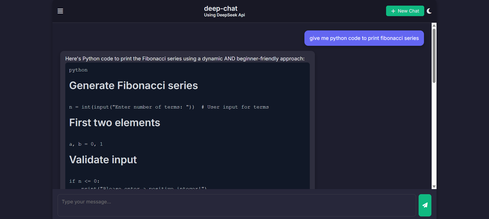
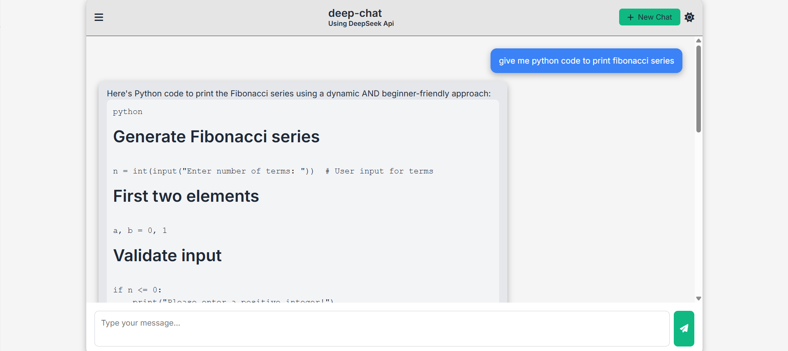
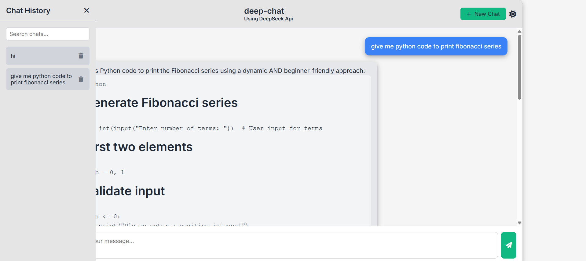

# 🤖 deep-chat – A ChatGPT Clone using DeepSeek API

Welcome to **deep-chat**, a modern and responsive AI chatbot interface built using **HTML**, **CSS**, and **JavaScript**, powered by the **DeepSeek API** via OpenRouter. This lightweight and clean interface replicates a ChatGPT-style experience with full support for markdown, code rendering, session history, dark/light theme, and more.

  


---

## 🚀 Features

- 🌗 **Dark / Light Theme Toggle**
- 📜 **Persistent Chat History (Stored in Local Storage)**
- ⌨️ **Markdown & Code Block Support**
- 🔁 **New Chat Session with Reset**
- 🔍 **Searchable Sidebar for Previous Chats**
- 🗑️ **Delete Old Chat Sessions**
- 📱 **Fully Responsive for Mobile and Desktop**
- 🔒 **Environment-safe API Key Handling**

---

## 🌐 Live Preview

[🔗 Click here for Live Demo](https://chatgpt-clone-theta-gold.vercel.app/)

---

## 📸 Screenshots

### 💬 Chat Interface (Dark Mode)


### ☀️ Light Mode Enabled


### 🧠 Chat History Sidebar


---

## 🛠️ Technologies Used

- **Frontend**: HTML, CSS (custom + responsive), Vanilla JavaScript
- **API Integration**: DeepSeek via OpenRouter
- **Markdown Parser**: Custom JavaScript renderer with support for:
  - Code Blocks
  - Bold/Italic/Strikethrough
  - Lists & Headings
  - Blockquotes & Hyperlinks

---

## 🧑‍💻 How to Run Locally

1. **Clone this repository**  
   ```bash
   git clone https://github.com/CodeWithVedang/deep-chat.git
   cd deep-chat
````

2. **Set up your OpenRouter API key**

   Create a `.env` file (if using a backend or Vercel) and add:

   ```env
   CHAT_API_KEY=your_openrouter_api_key_here
   ```

3. **Run with Live Server or deploy to Vercel**

   For development:

   ```bash
   npm install -g live-server
   live-server
   ```

---

## 📁 Project Structure

```
deep-chat/
├── index.html         # Main HTML structure
├── style.css          # All custom and responsive styles
├── script.js          # Client-side logic, chat rendering, and theme
├── api/chat.js        # Backend API call to DeepSeek via OpenRouter
└── assets/            # (Add your screenshots here)
```

---

## ⚠️ Note on API Usage

The chat interface uses the **DeepSeek model** from OpenRouter:

* Model: `deepseek/deepseek-r1-0528:free`
* All responses are structured in Markdown and English.

Ensure your API key is kept **private** and secure (not exposed in the frontend).

---

## 🙋‍♂️ Author

**Vedang Shelatkar**
🔗 [GitHub Profile](https://github.com/CodeWithVedang)
🧠 Passionate about building intelligent UIs & automation.

---

## 📃 License

This project is open-source and available under the [MIT License](LICENSE).

---

✨ *Feel free to fork, contribute, or drop a ⭐ if you like this project!*

```

